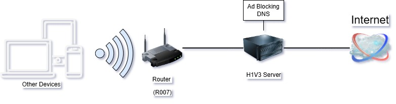

# H1V3 - Self-Hosted Home-Lab Server

## Motivation and Purpose

I have built a self-hosted server and have been maintaining since 2022. Started as a basic VPN server and became much more as I improved my technical skills. It's an endless opportunity of hands-on experimenting with new technologies in a controlled environment and gain experience on topics that were abstract to me as project management, system administration and networking.

- [H1V3 - Self-Hosted Home-Lab Server](#h1v3---self-hosted-home-lab-server)
	- [Motivation and Purpose](#motivation-and-purpose)
	- [Structures](#structures)
		- [**Hardware \& OS**](#hardware--os)
		- [**Connections**](#connections)
		- [**'Animal Kingdom' Domain Name System**](#animal-kingdom-domain-name-system)
	- [Projects](#projects)
		- [1. **H0N3Y**](#1-h0n3y)
		- [2. **H1V3 M1ND**](#2-h1v3-m1nd)
		- [3. **W3453L**](#3-w3453l)
		- [4. **Custom Shell Scripts**](#4-custom-shell-scripts)
	- [Services](#services)
	- [Skills Developed](#skills-developed)
	- [Contact Information](#contact-information)

## Structures

### **Hardware & OS**

Raspberry Pi 4B - 4GB RAM running Raspberry Pi OS 64bit (no desktop)

### **Connections**

### **'Animal Kingdom' Domain Name System**

Numerical animal/habitat domain names for devices under the home network. Becomes easy to access, track and identify each device on the network. Visualizes a consistent, integrated system. Purpose of the device/service in the network matches with the animal's/habitat's role in nature.

	Hive -> H1V3 
	Tiger -> 7163R 
	Safari -> 54F4R1

[Inspiration](https://www.sciencealert.com/your-ability-to-read-this-message-really-does-reveal-something-incredible-about-the-mind)

## Projects

### 1. **H0N3Y**

**Description**: Synchronization between my personal *Google Drive* and *OneDrive* 
**Reasoning**: Use both Google's and Microsoft's cloud drive features on different platforms with same files. 

**Technologies Used**:

- Python
- [RClone](https://rclone.org/)
- Shell script
- HTML

**Key Features**:

- Sync selected folders in *OneDrive* with *Google Drive* periodically.
- Create a report of changes that are made and notify via e-mail daily and if a change were made

**Role**: Development of automated sync scripts, report generation, and maintaining. 
[see more...](projects/H0N3Y.md)

### 2. **H1V3 M1ND**

**Description**: Smart home management platform built with [Home Assistant](https://www.home-assistant.io/)  
**Reasoning**: Connect different types of smart appliances under same platforms, enable communication in between  
**Technologies Used**:

- [Home Assistant](https://www.home-assistant.io/)
- Docker
- Jinja

**Key Features**:

- Automate home lighting based on: owner location, time of day, use of appliances
- Automate music playback based on current room
- Recommend outfit based on weather and calendar event
- Notify battery status of connected devices
- Notify server status

**Role**: Automation and artificial sensor development on an open-source project. 
[see more...](projects/H1V3_M1ND.md)

### 3. **W3453L**

**Description**: Android Phone server for UI needed automation and act as GSM server 
**Reasoning**: Execute UI processes on android app for limited home automation APIs (ex: Tuya IR devices, SmartThings) 
**Technologies Used**:

- Android
- [MacroDroid](https://www.macrodroid.com/)

**Key Features**:

- Mimics pushing to buttons on Tuya devices that are unavailable on [Home Assistant](https://www.home-assistant.io/)
- WhatsApp chat bot for smart home status
- Call handling and notifying owner when traveling abroad

**Role**: Automation development on [MacroDroid](https://www.macrodroid.com/).

### 4. **Custom Shell Scripts**

**Description**: Series of shell scripts for maintaining the server and other services 
**Reasoning**: Reduce the hassle of running same Linux commands for repetitive situations 
**Technologies Used**:

- Shell script
- Cron

**Key Features**:

- Backup system
- Summarize service status for monitoring
- Restart and backup Docker containers
- Remotely turn on other PCs

**Role**: Shell script development and maintaining cron jobs 
[see more...](projects/Scripts.md)

## Services
Other installed services for convenient access and maintaining the server  
1. **[Heimdall](https://heimdall.site/)**: Web interface to access, monitor or maintain projects and running services.
2. **[PiVPN](https://www.pivpn.io/)**: Secure connection to home network from outside with OpenVPN protocol.
3. **[Pi-Hole](https://pi-hole.net)**: Monitor internet traffic, ad-blocking and maintain DHCP server.
4. **[OliveTin](https://www.olivetin.app/)**: Web interface to execute custom scripts or trigger automated scripts.
5. **[Motion](https://motion-project.github.io/)**: Use webcam as a security camera.
6. **[VS Code](https://code.visualstudio.com/)**: Benefit from Remote SSH extension for easy software development, file management and Docker maintenance

## Skills Developed

- **Networking**: Configuring and managing network settings and security.
- **System Administration**: Managing and maintaining server hardware and software.
- **Cloud Computing**: Develop, deploy and maintain software on a remote environment.
- **Containerization**: Using Docker for containers application deployment and management.
- **Open Source Projects**: Tinkering and adjusting open-sourced projects to my needs.
- **Automation**: Detect repetitive tasks and design proper structures to automate them.
- **Software Development**: Experience languages and concepts outside my tech skill-set and comfort-zone.
- **Project Management**: Create tasks and plan them based on subjects, urgency and arrange deadlines according to priority of tasks.

## Contact Information

- **Email**: <dogac.seyhan@gmail.com>
- **LinkedIn**: [Doğaç Seyhan](https://www.linkedin.com/in/dogac-seyhan)
- **GitHub**: [null-p01ntr](https://github.com/null-p01ntr)
- **X (former Twitter)**: [null_p01nter](https://x.com/null_p01nter)

