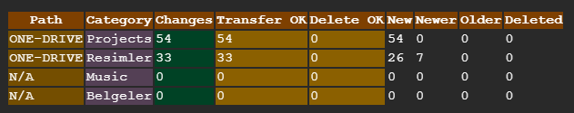
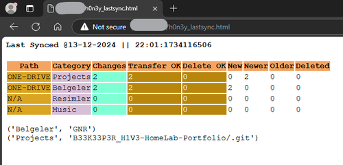
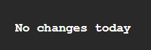
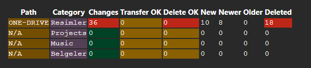

# H0N3Y - Cloud Drive Sync System

## Overview

This project synchronizes given cloud drive locations with each other. With this done periodically, user can access it's files from any preferred platform. Enabling different features and advantages of different cloud platforms with same files.


## Features

- **Bidirectional sync between cloud locations**: Creates a link between two cloud drive locations. Two cloud locations exchange updates in both directions, keeping their data consistent and resolving conflicts when needed.
- **Notify the user for changes**: Sends information to user about any changes have occurred in a table format via e-mail. Reports are sent daily or if a change has occurred.

## Technologies Used

- *[RClone](https://rclone.org/)* to authorize cloud drive accounts and handle the synchronization process
- *Shell scripts* to execute [RClone](https://rclone.org/) synchronization commands.
- *Python* to do reporting of the changes.
- *Cron jobs* to make it execute periodically at certain times.

## Usage

The process runs periodically defined by cron jobs, Frequency can be adjusted to the user's needs. Based on experience it is better to sync at offline hours while not modifying anything on defined locations.

### BiSync Commands

This commands execute for each defined cloud locations and applies the changes to the other side and vice versa. Changes can include: new file addition, changing a file, deletion of a file etc.

```bash
rclone bisync $DRIVE_1:$FOLDER_1 $DRIVE_2:$FOLDER_2 -v --remove-empty-dirs --resilient 2> $LOG_PATH
```

`-v` is to print out steps of the process for a detailed log..</br>
`--remove-empty-dirs` deletes empty folders on each side for a cleaner deletion process.</br>
`--resilient` Retries if an error occurs.

### Log Reports

Creates a data-frame with the needed data using pandas

```python
    summary_df = pd.DataFrame(columns= ['log_hour', 'path','category','changes','OK_transfer','OK_delete','new','newer','older','deleted'])
    numeric_columns = ['changes','OK_transfer','OK_delete','new','newer','older','deleted']
    summary_df[numeric_columns] = summary_df[numeric_columns].apply(pd.to_numeric)
```

Python script analyzes the log files generated by the RClone scripts, gets the number and paths of the modified files/directories.

```python
# iterate over files
log_directory = 'LOG_FILES_DIRECTORY'
changed_folders = []
for f in os.listdir(log_directory):
    log_file = os.path.join(log_directory, f)
    # checking if it is a file
    if os.path.isfile(log_file):
        #define regex patterns to detect change counts
        error_pattern = r".*ERROR.*"
        no_change_pattern = r".*No changes found"
        diff_pattern = r'.*(?P<path>Path\d):\s*(?P<changes>\d*) changes:\s*(?P<new>\d*) new,\s*(?P<newer>\d*) newer,\s*(?P<older>\d*) older,\s*(?P<deleted>\d*) deleted'
        transfer_result_pattern = r'Transferred:\s*(?P<transferred>\d*) / \d*, \d*%'
        deleted_result_pattern = r'Deleted:\s*(?P<deleted>\d*) \(files\), \d* \(dirs\)'
        change_details_pattern = r'.*Path*.*-\s(?P<file_path>.*:.*\/+.*)'
        # match with patterns
        # assign to corresponding columns
```

Sends the data frame to the user via e-mail

```python
def send_email(body, subject):
    # define to, sender and password
    
    msg = MIMEMultipart('alternative')
    msg['Subject'] = subject
    msg['From'] = formataddr((sender_name,sender))
    msg['To'] = to
    
    html = MIMEText(body, 'html')
    msg.attach(html)
    
    with smtplib.SMTP_SSL('smtp.gmail.com', 465) as smtp_server:
        smtp_server.login(sender, password)
        smtp_server.sendmail(sender, to, msg.as_string())
```

### Organize Log Files

Creates folder foe new logs and deletes old log files

```shell
new_day=$(date +"%d_%m_%Y")
last_week=$(date -d 'last week' +"%d_%m_%Y")

mkdir /home/b33k33p3r/h0n3y/logs/$new_day   #create new date directory
rm -r /home/b33k33p3r/h0n3y/logs/$last_week #remove last week directory
```

### Expected Output

After each run, all of the content is same between synced cloud locations.
If user wants to sync locations outside sync hours, the commands can execute manually without affecting automatic process.

Report is sent daily at last run of the day
If change has occurred the report is sent immediately.



The report table is also hosted locally, indication with last updated datetime.



Simple text output if no change detected



Table displays the number of affected files at the path that the change is made, by the given action. OK columns indicates the number of successful actions, other columns are the changes that are detected. If number of successful actions doesn't match the number of detected changes there has been an error.

Table style changes to indicate errors



[Other projects on H1V3](../README.md)
