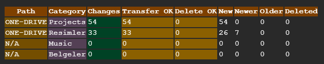
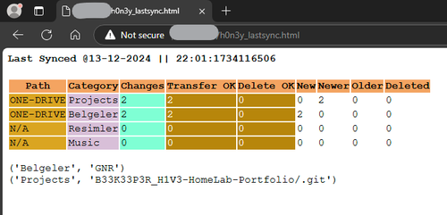
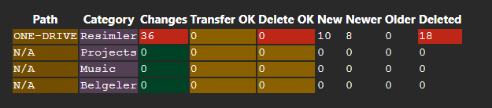

# H0N3Y - Cloud Drive Sync System

## Overview

This project keeps a OneDrive account and a Google Drive account in two-way sync — four
folder pairs, five times a day, on a cron schedule. There is no daemon, no container and
no port: it is a shell script and a Python reporter,
invoked periodically, that exist to answer one question after every run — did the sync
actually work, and if not, why.


## Features

- **Bidirectional sync across four independent folder pairs**: each category syncs both
  ways on its own schedule slot, so one large category running long doesn't block the
  smaller ones.
- **Resilient by default**: a transient error retries automatically instead of failing
  the run outright, a lost sync baseline rebuilds itself from a backup listing rather
  than requiring a manual rebuild, and a crashed run's lock file expires on its own
  after a timeout instead of blocking every future run indefinitely.
- **Manual, forced and per-category runs**: any pair can be synced on demand, outside
  the schedule, without disturbing the automatic one.
- **Daily rolling status**: each category's state for the day is tracked centrally, so
  a single bad run early in the day is not lost by the time the last run finishes.
- **Multi-channel notification**: an e-mail summary/alert, a locally hosted status
  webpage updated after every run, and a desktop popup triggered through the smart-home
  platform.
- **External heartbeat monitoring**: each run reports its start/finish/exit status to a
  third-party monitor, so a schedule that silently stops firing is still caught even if
  the sync itself never gets the chance to say so.
- **Automatic log rotation**: a rolling multi-day retention window, so disk usage from
  logging stays bounded without manual cleanup.

## Technologies Used

- *[RClone](https://rclone.org/)* to authorize cloud drive accounts and handle the
  bidirectional synchronization itself
- *Shell scripts* for the cron entry point, manual runs, and log rotation
- *Python* (with `pandas`) to parse each run's logs and build the report
- *Cron* to run the schedule periodically; a third-party heartbeat service wraps each
  run to catch a schedule that stops firing entirely
- *Home Assistant* as a notification channel — a desktop popup is triggered on
  successful/failed runs, alongside the e-mail report

## Usage

The process runs periodically defined by cron jobs, five times a day by default.
Frequency and timing can be adjusted to the user's needs. Based on experience it is
better to schedule the bulk of the runs at offline hours while not modifying anything on
the synced locations.

### Script Inventory

Five scripts make up the system, all invoked by cron or by hand rather than run as a
service:

| Script | What it does |
|---|---|
| Auto sync | The cron entry point. Syncs all four category pairs in order, one log file per category, then hands off to the reporter. |
| Manual sync | On-demand sync outside the schedule, forced and per-category (one flag per category, or all four with no flag). |
| Resync | Rebuilds the sync baseline from whatever both cloud sides currently hold. Destructive by nature — it *declares* one side authoritative rather than reconciling, so it's a deliberate, manual recovery step, not something run casually. |
| Log rotation | Creates the day's log directory and removes the one from exactly a set retention window ago. |
| Reporter | Parses the day's logs, updates the rolling daily status, updates the status webpage, sends the e-mail, and fires the Home Assistant popup. |

### BiSync Commands

This command executes for each of the four category pairs and applies changes on both
sides — new files, edits, deletions — kept in sync in both directions.

```bash
rclone bisync $ONEDRIVE_REMOTE:$CATEGORY_SOURCE_PATH $GDRIVE_REMOTE:$CATEGORY_DEST_PATH \
  -v --remove-empty-dirs --resilient --recover --max-lock 15m 2> $LOG_PATH
```

`-v` prints each step for a detailed log.</br>
`--remove-empty-dirs` deletes empty folders on each side for a cleaner deletion process.</br>
`--resilient` lets a run that hit a retryable error be reported and retried, rather than
being treated as a hard failure.</br>
`--recover` rebuilds from a backup listing of the last known-good state if the primary
sync baseline can't be found, instead of refusing to run until a full resync.</br>
`--max-lock 15m` expires a stale lock left behind by a crashed run automatically, so one
bad run costs a single skipped cycle instead of blocking sync indefinitely; the lock is
renewed periodically while a run is genuinely still in progress.

Category names differ from folder names on each side — OneDrive keeps one side's
folders in the account owner's own language, Google Drive keeps the other in English,
and one category nests an extra level deep on the OneDrive side. None of that is a bug;
the category label is the stable handle every script and log uses regardless of what
each cloud actually calls the folder.

### Log Reports

Creates a data-frame with the needed data using pandas

```python
    summary_df = pd.DataFrame(columns= ['log_hour', 'path','category','changes','OK_transfer','OK_delete','new','newer','older','deleted'])
    numeric_columns = ['changes','OK_transfer','OK_delete','new','newer','older','deleted']
    summary_df[numeric_columns] = summary_df[numeric_columns].apply(pd.to_numeric)
```

Python script analyzes the log files generated by the RClone scripts, gets the number and paths of the modified files/directories.

```python
# iterate over files
log_directory = 'LOG_FILES_DIRECTORY'
changed_folders = []
for f in os.listdir(log_directory):
    log_file = os.path.join(log_directory, f)
    # checking if it is a file
    if os.path.isfile(log_file):
        #define regex patterns to detect change counts
        error_pattern = r".*ERROR.*"
        no_change_pattern = r".*No changes found"
        diff_pattern = r'.*(?P<path>Path\d):\s*(?P<changes>\d*) changes:\s*(?P<new>\d*) new,\s*(?P<newer>\d*) newer,\s*(?P<older>\d*) older,\s*(?P<deleted>\d*) deleted'
        transfer_result_pattern = r'Transferred:\s*(?P<transferred>\d*) / \d*, \d*%'
        deleted_result_pattern = r'Deleted:\s*(?P<deleted>\d*) \(files\), \d* \(dirs\)'
        change_details_pattern = r'.*Path*.*-\s(?P<file_path>.*:.*\/+.*)'
        # match with patterns
        # assign to corresponding columns
```

The classification patterns themselves live in a small JSON config rather than being
hardcoded in the script, so adjusting what counts as a warning/error/lock condition is a
config change, not a code change.

Each category's result for the day is folded into a rolling daily summary — every run
that day updates it rather than replacing it — so a problem caught at the first run of
the day is still visible by the last one, even if every run in between was clean.

Sends the data frame to the user via e-mail, refreshes the local status webpage, and
triggers a Home Assistant popup notification alongside it:

```python
def send_email(body, subject):
    # define to, sender and password
    
    msg = MIMEMultipart('alternative')
    msg['Subject'] = subject
    msg['From'] = formataddr((sender_name,sender))
    msg['To'] = to
    
    html = MIMEText(body, 'html')
    msg.attach(html)
    
    with smtplib.SMTP_SSL('smtp.gmail.com', 465) as smtp_server:
        smtp_server.login(sender, password)
        smtp_server.sendmail(sender, to, msg.as_string())
```

### External Heartbeat Monitoring

Each scheduled run is wrapped by a third-party monitoring service that records its
start, finish and exit status independently of H0N3Y's own reporting. It's the one
signal that survives the case where the sync never runs at all — nothing in H0N3Y's own
logs or e-mail exists to report an absence, since there's nothing to report from. The
badge it produces is embedded in the summary e-mail and the status page.

### Organize Log Files

Creates a directory for the new day's logs and removes the one outside the retention
window, keeping log storage bounded automatically without manual cleanup.

```shell
new_day=$(date +"%d_%m_%Y")
last_week=$(date -d 'last week' +"%d_%m_%Y")

mkdir $LOG_DIR/$new_day   #create new date directory
rm -r $LOG_DIR/$last_week #remove directory outside the retention window
```

### Manual Usage

The manual script runs the bisync commands on demand, with `--force` to bypass the
usual safety prompts and per-category flags to target a single pair instead of all four.

```shell
rclone bisync $ONEDRIVE_REMOTE:$CATEGORY_SOURCE_PATH $GDRIVE_REMOTE:$CATEGORY_DEST_PATH -v --remove-empty-dirs --resilient --force
```

Flags select which category (or categories) to run; omitting all of them runs every
pair. The real script has one flag per category — shown here with two made-up examples,
the rest follow the same pattern.

```shell
run_all=true
run_a=false
run_b=false
# one flag per category

while [[ "$#" -gt 0 ]]; do
    case $1 in
        -a) run_a=true; run_all=false ;;
        -b) run_b=true; run_all=false ;;
        # additional categories follow the same pattern
        *) echo "Unknown option: $1"; exit 1 ;;
    esac
    shift
done

if [[ "$run_all" == true || "$run_a" == true ]]; then
    echo "_P0LLIN4T1N6 'Category A'"
    rclone bisync $DRIVE_1:$FOLDER_1 $DRIVE_2:$FOLDER_2 -v --remove-empty-dirs --resilient --force
fi
if [[ "$run_all" == true || "$run_b" == true ]]; then
    echo "_P0LLIN4T1N6 'Category B'"
    rclone bisync $DRIVE_1:$FOLDER_3 $DRIVE_2:$FOLDER_4 -v --remove-empty-dirs --resilient --force
fi
```

With this structure the script can be run by `h0n3y manual -a` or `h0n3y manual -b` for
syncing just a single category.

A separate resync mode exists for rebuilding a lost sync baseline outright, but it's
deliberately not part of the regular flag set above: `--resync` doesn't repair a pair,
it declares whichever side it reads to be the truth and rebuilds around that — a
decision that needs a human to say which side is actually correct, not something a
script should default to.

### Expected Output

After each run, all of the content is same between synced cloud locations.
If user wants to sync locations outside sync hours, the manual script can be executed without affecting automatic process.

Report is sent daily at last run of the day
If change has occurred the report is sent immediately.



The report table is also hosted locally, indication with last updated datetime.



Simple text output if no change detected


Table displays the number of affected files at the path that the change is made, by the given action. OK columns indicates the number of successful actions, other columns are the changes that are detected. If number of successful actions doesn't match the number of detected changes there has been an error.

Table style changes to indicate errors



[Other projects on H1V3](../README.md)
