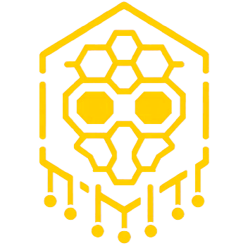

# H1V3 M1ND - Smart Home Platform

## Overview

This project is an instance of Home Assistant - Smart Home Management platform. I have implemented advanced home automation systems to enhance convenience, and energy efficiency within my home. dDeveloped custom automations and a variety of sensors to create a seamless and intelligent smart home experience.  



## Index

- **[Automations](#automations)**
  - [Media Playback Room Transfer](#media-playback-room-transfer---automation)
  - [Meeting Mode](#meeting-mode---automation)
  - [Meeting Lighting Preset](#meeting-lighting-preset---automation)
  - [Charge Handler](#charge-handler---automation)
  - [Phone Ringing](#phone-ringing---automation)
  - [Power Saving](#power-saving---automation)
  - [Calendar Event Tracker](#calendar-event-tracker---automation)
- **[Scripts](#scripts)**
  - [Gradually Change Brightness](#gradually-change-brightness---script)
  - [Notify Multiple Devices](#notify-multiple-devices---script)
- **[Sensors](#sensors)**
  - [Portable Drive Location](#portable-drive-location---sensor)
  - [PC Mode](#pc-mode---sensor)
- **[Subsystems](#subsystems)**
  - [Robot Vacuum Cleaning Queue](#robot-vacuum-cleaning-queue---subsystem)

## Features


- **Automated Device Configurations**: Modify setting of devices on the network based on other events on other devices such as:
	- Alert owner for low ba
  - Phone ringing
  - User entered an online meeting
  - User changed room
  - Certain media type being played (movie or music)
- **Calendar Event Tracker**: Change device settings on the network based on calendar events, such as:
	- Changing arm mode
	- Run power saving routines
	- Adjust for other users and guests.
	- Notify user for weather info
- **Automated Lights**: Lights at home automatically turns on or off based on:
	- User's current room
	- Weather (changes brightness according to cloud coverage)
	- Before Sunset
- **Power saving Solutions**: Regularly track and power off unnecessary devices  based on usage and home arm mode. Notify user if power off failed or not available.
  
## Technologies Used

- *[Home Assistant](https://www.home-assistant.io/)*, open sourced base of smart home platform 
- *Yaml and Jinja* for defining automations and templating custom sensors
- *Docker* for maintaining service status, updates and backups

## Usage

Automations are developed using the YAML language by defining triggers, conditions, and actions, utilizing built-in variables known as sensors. For more complex sensors or those that depend on multiple devices, Jinja templates can be used to define custom sensors.

### Automations

#### Media Playback Room Transfer - Automation
If user changes room while media is playing, the media playback is transferred to the devices that are available at users current room. Retries source-selection with a validation check until the new device actually reports itself as the active source, rather than assuming the first attempt worked.

<details>
	<summary>Show YAML code</summary>

```yaml
trigger:
  - platform: state
    entity_id: {{ROOM_LOCATION_SENSOR}}
    for:
      seconds: 5
condition:
  - condition: state
    entity_id: {{HOME_MODE_SENSOR}}
    state: {{ALONE_MODE}}
action:
  - choose:
      - conditions:
          - condition: state
            entity_id: {{ROOM_LOCATION_SENSOR}}
            state: {{ROOM_A}}
        sequence:
          - action: retry.action
            target:
              entity_id: {{MEDIA_PLAYER_ENTITY}}
            data:
              action: media_player.select_source
              source: {{SOURCE_NAME_FOR_ROOM_A}}
              validation: "[[ state_attr({{MEDIA_PLAYER_ENTITY}}, 'source') == source ]]"
              retries: 10
              state_delay: 1.1
      - conditions:
          - condition: state
            entity_id: {{ROOM_LOCATION_SENSOR}}
            state:
              - {{ROOM_B}}
              - {{ROOM_B_ALT_STATE}}
        sequence:
          - action: switch.turn_on
            target:
              entity_id: {{ROOM_B_SPEAKER_SWITCH}}
          - action: retry.action
            target:
              entity_id: {{MEDIA_PLAYER_ENTITY}}
            data:
              action: media_player.select_source
              source: {{SOURCE_NAME_FOR_ROOM_B}}
              validation: "[[ state_attr({{MEDIA_PLAYER_ENTITY}}, 'source') == source ]]"
              retries: 10
              state_delay: 1.1
      # REPEAT FOR DESIRED ROOMS/DEVICES
  - delay:
      seconds: 3
  - action: media_player.media_play
    target:
      entity_id: {{MEDIA_PLAYER_ENTITY}}
  - action: script.notify_targets
    data:
      targets: {{NOTIFY_TARGETS}}
      notification_title: "{{APP_NAME}} Playback"
      notification_message: "Transferred to `{{ROOM_LOCATION_SENSOR}}`, now playing from `{{MEDIA_PLAYER_ENTITY}}`"
```
</details>

#### Meeting Mode - Automation

Watches microphone and webcam activity on the user's PCs. When either turns on inside a recognized meeting app during the day, and the user is home alone, each phone that isn't already silenced is switched to meeting/DND mode, and any playing music is paused.

<details>
	<summary>Show YAML code</summary>

```yaml
trigger:
  - platform: state
    entity_id:
      - {{PC1_MIC_PROCESS_SENSOR}}
      - {{PC1_CAM_PROCESS_SENSOR}}
    for:
      seconds: 30
  - platform: state
    entity_id:
      - {{PC2_MIC_PROCESS_SENSOR}}
      - {{PC2_CAM_PROCESS_SENSOR}}
    for:
      seconds: 30
condition:
  - condition: sun
    after: sunrise
    before: sunset
  - condition: state
    entity_id: {{HOME_MODE_SENSOR}}
    state: {{ALONE_MODE}}
  - condition: template
    value_template: >
      
      
      
      {{ mic_hits + cam_hits > 0 }}
action:
  - if:
      - condition: state
        entity_id: {{MUSIC_PLAYER_ENTITY}}
        state: playing
    then:
      - action: media_player.media_pause
        target:
          entity_id: {{MUSIC_PLAYER_ENTITY}}
  - if:
      - condition: state
        entity_id: {{PHONE_1_DND_SENSOR}}
        state: "off"
    then:
      - action: script.{{DEVICE_ORDER_SCRIPT}}
        data:
          order: Meeting
          targets:
            - {{PHONE_1_DEVICE_ID}}
  - if:
      - condition: state
        entity_id: {{PHONE_2_DND_SENSOR}}
        state: "off"
    then:
      - action: script.{{DEVICE_ORDER_SCRIPT}}
        data:
          order: Meeting
          targets:
            - {{PHONE_2_DEVICE_ID}}
```
</details>

#### Meeting Lighting Preset - Automation

A small companion automation, separate from Meeting Mode above: as soon as one PC's webcam turns on inside a recognized meeting app, that room's lighting switches to a plain preset scene. No home-mode or time-of-day gate — it fires any time the webcam is in use.

<details>
	<summary>Show YAML code</summary>

```yaml
trigger:
  - platform: state
    entity_id: {{PC_CAM_PROCESS_SENSOR}}
    to:
      - {{MEETING_APP_1}}
      - {{MEETING_APP_2}}
    for:
      seconds: 30
action:
  - action: scene.turn_on
    target:
      entity_id: {{ROOM_NORMAL_LIGHTING_SCENE}}
```
</details>

#### Charge Handler - Automation

Two patterns, both keyed off a device's own battery sensors, chosen per device depending on whether it sits on a controllable smart-plug charger:

- **Alert-only** (no controllable charger, e.g. a laptop): a single low-battery threshold sends a notification. Nothing is switched.
- **Charger-controlled** (on a smart plug): four triggers — low, critical, "done", and battery-reports-full — drive a discharge-aware loop that keeps nudging the plug on, a distinct notification when nobody is home to actually plug it in, and turns the charger off once full.

<details>
	<summary>Show YAML code — alert-only pattern</summary>

```yaml
trigger:
  - platform: numeric_state
    entity_id: {{BATTERY_LEVEL_SENSOR}}
    below: {{LOW_BATTERY_PCT}}
action:
  - action: script.{{NOTIFY_CHARGE_ALERT_SCRIPT}}
    data:
      targets: {{NOTIFY_TARGETS}}
      low_battery_device: {{DEVICE_ID}}
```
</details>

<details>
	<summary>Show YAML code — charger-controlled pattern</summary>

```yaml
trigger:
  - platform: numeric_state
    entity_id: {{BATTERY_LEVEL_SENSOR}}
    above: {{FULL_BATTERY_PCT}}
    id: done_charge
  - platform: numeric_state
    entity_id: {{BATTERY_LEVEL_SENSOR}}
    below: {{LOW_BATTERY_PCT}}
    id: need_charge
  - platform: numeric_state
    entity_id: {{BATTERY_LEVEL_SENSOR}}
    below: {{CRITICAL_BATTERY_PCT}}
    id: critical_charge
  - platform: state
    entity_id: {{BATTERY_STATE_SENSOR}}
    to: full
    id: full_charge
action:
  - choose:
      - conditions:
          - condition: trigger
            id: [critical_charge, need_charge]
        sequence:
          - if:
              - condition: not
                conditions:
                  - condition: state
                    entity_id: {{HOME_MODE_SENSOR}}
                    state: {{EMPTY_MODE}}
            then:
              # nudge the smart plug on until the device actually starts drawing power
              - repeat:
                  sequence:
                    - action: switch.turn_on
                      target:
                        entity_id: {{CHARGE_SOCKET_SWITCH}}
                    - delay:
                        seconds: 2
                  while:
                    - condition: state
                      entity_id: {{BATTERY_STATE_SENSOR}}
                      state: discharging
              - action: script.{{NOTIFY_CHARGE_HANDLER_SCRIPT}}
                data:
                  targets: {{NOTIFY_TARGETS}}
                  low_battery_device: {{DEVICE_ID}}
                  charger_status: "{{ states('{{CHARGE_SOCKET_SWITCH}}') }}"
                  battery_status: "{{ states('{{BATTERY_STATE_SENSOR}}') }}"
            else:
              # nobody home to plug it in -- say so, don't pretend it's charging
              - action: script.{{NOTIFY_CHARGE_HANDLER_SCRIPT}}
                data:
                  targets: {{NOTIFY_TARGETS}}
                  low_battery_device: {{DEVICE_ID}}
                  charger_status: "WILL NOT CHARGE"
                  battery_status: "HOME EMPTY"
      - conditions:
          - condition: trigger
            id: [done_charge, full_charge]
        sequence:
          - action: switch.turn_off
            target:
              entity_id: {{CHARGE_SOCKET_SWITCH}}
```
</details>

#### Phone Ringing - Automation

When either of the user's phones rings, every active media source pauses — music, the living-room TV/streaming stick, and any active audio session on either PC — and the robot vacuum pauses too if it's mid-clean. Everything resumes once the call ends.

<details>
	<summary>Show YAML code</summary>

```yaml
trigger:
  - platform: state
    entity_id: {{PHONE_1_STATE_SENSOR}}
    to:
      - ringing
      - offhook
    id: phone_1_rang
  - platform: state
    entity_id: {{PHONE_2_STATE_SENSOR}}
    to:
      - ringing
      - offhook
    id: phone_2_rang
  # REPEAT PER PHONE ON THE NETWORK
condition:
  - condition: state
    entity_id: {{HOME_MODE_SENSOR}}
    state: {{ALONE_MODE}}
action:
  - if:
      - condition: state
        entity_id: {{VACUUM_ENTITY}}
        state:
          - cleaning
          - returning
    then:
      - action: vacuum.pause
        target:
          entity_id: {{VACUUM_ENTITY}}
  - if:
      - condition: state
        entity_id: {{TV_STREAMING_STICK_PLAYER}}
        state: "on"
    then:
      - action: media_player.media_pause
        target:
          entity_id: {{TV_STREAMING_STICK_PLAYER}}
    else:
      - action: media_player.media_pause
        target:
          entity_id: {{TV_PLAYER}}
  - if:
      - condition: state
        entity_id: {{MUSIC_PLAYER_ENTITY}}
        state: playing
    then:
      - action: media_player.media_pause
        target:
          entity_id: {{MUSIC_PLAYER_ENTITY}}
  # REPEAT pause/resume for each PC's active audio session, keyed off its own
  # "what's making sound right now" sensor
  - choose:
      - conditions:
          - condition: trigger
            id: phone_1_rang
        sequence:
          - wait_for_trigger:
              - platform: state
                entity_id: {{PHONE_1_STATE_SENSOR}}
                to: idle
                for:
                  seconds: 15
            continue_on_timeout: false
      - conditions:
          - condition: trigger
            id: phone_2_rang
        sequence:
          - wait_for_trigger:
              - platform: state
                entity_id: {{PHONE_2_STATE_SENSOR}}
                to: idle
                for:
                  seconds: 15
            continue_on_timeout: false
  # resume whichever of vacuum / TV / music / PC audio was actually paused above
  - action: media_player.media_play
    target:
      entity_id: {{MUSIC_PLAYER_ENTITY}}
```
</details>

#### Power Saving - Automation

After a room has been unoccupied for a while, its lights (and other switches in it) turn off automatically — but only while the user is home alone, never with guests present, so a guest's room never goes dark on them. Two related automations round this Feature out: one compares router / server / Home-Assistant boot timestamps to detect an unplanned power loss and offers a one-tap "graceful shutdown" vs. "turn off non-critical devices" choice; another watches backup-storage capacity and alerts past a threshold.

<details>
	<summary>Show YAML code</summary>

```yaml
trigger:
  - platform: state
    entity_id: {{ROOM_LOCATION_SENSOR}}
    for:
      minutes: 30
condition:
  - condition: state
    entity_id: {{HOME_MODE_SENSOR}}
    state: {{ALONE_MODE}}
action:
  - if:
      - condition: not
        conditions:
          - condition: state
            entity_id: {{ROOM_LOCATION_SENSOR}}
            state:
              - {{ROOM_A}}
              - {{ROOM_A_ALT_STATE}}
    then:
      - action: light.turn_off
        target:
          entity_id: {{ROOM_A_LIGHT}}
      - action: switch.turn_off
        target:
          area_id: {{ROOM_A_AREA}}
  # REPEAT PER ROOM
```
</details>

#### Calendar Event Tracker - Automation

Five minutes before a calendar event starts, the user's phone gets a weather-and-outfit notification built from the local weather integration and the event's location. *(Note: the Features list above also describes arm-mode changes and guest-specific adjustments driven by calendar events — live, only the weather/outfit branch is currently enabled; the away/guest-description branches exist in the automation but are switched off, so that part of the Feature isn't active today.)*

<details>
	<summary>Show YAML code</summary>

```yaml
trigger:
  - platform: calendar
    event: start
    offset: "-00:05:00"
    entity_id: {{CALENDAR_ENTITY}}
action:
  - variables:
      weather_summary: >
        {{ states('{{WEATHER_ENTITY}}') }}
        Temp: {{ state_attr('{{WEATHER_ENTITY}}', 'temperature') }}
        Feels like: {{ states('{{FEELS_LIKE_TEMP_SENSOR}}') }}
        UV index: {{ states('{{UV_INDEX_SENSOR}}') }}
        Rain: {{ states('{{RAIN_SENSOR}}') }}
      outfit_message: >
        
        
          Check the weather for {{ event_city }} instead of home
        
          {# suggest an outfit from the feels-like temperature band #}
        
  - action: notify.{{MOBILE_DEVICE}}
    data:
      title: "{{EVENT_TITLE}}"
      message: "{{ weather_summary }}\n{{ outfit_message }}"
```
</details>

### Scripts

#### Gradually Change Brightness - Script

Dim or brighten up certain smart light over time. Perfect for wake up and going to sleep.

<details>
	<summary>Show YAML code</summary>

```yaml
sequence:
  - metadata: {}
    data:
      brightness_pct: 30
      rgb_color:
        - 255
        - 149
        - 0
    target:
      entity_id: {{LIGHT_ENTITY}}
    action: light.turn_on
  - delay:
      hours: 0
      minutes: 0
      seconds: 5
      milliseconds: 0
  - repeat:
      sequence:
        - delay:
            hours: 0
            minutes: 3
            seconds: 0
            milliseconds: 0
        - metadata: {}
          data:
            brightness_step_pct: -/+2 # - FOR DIM, + FOR BRIGHTEN 
          target:
            entity_id: {{LIGHT_ENTITY}}
          action: light.turn_on
      until:
        - condition: or
          conditions:
            - condition: numeric_state
              entity_id: {{LIGHT_ENTITY}}
              attribute: brightness
              below: 5  # FOR DIM
              above: 95 # FOR BRIGHTEN
  - action: light.turn_off
    metadata: {}
    data: {}
    target:
      entity_id: {{LIGHT_ENTITY}}
```
</details>

#### Notify Multiple Devices - Script

Easily notify desired devices with single activity. Keeps recurring notification formats organized.

<details>
	<summary>Show YAML code</summary>

```yaml
sequence:
  - repeat:
      sequence:
        - action: notify.mobile_app_{{ device_attr( repeat.item , 'name') | lower }}
          metadata: {}
          data:
            title: "{{ notification_title }}"
            message: "{{ notification_message }}"
            data: "{{ notification_data }}"
      for_each: "{{ targets }}"
fields:
  targets:
    selector:
      device:
        multiple: true
    name: Targets
    required: true
    description: target notification devices
  notification_message:
    selector:
      text: null
    name: Notification Message
    required: true
  notification_data:
    selector:
      text: null
    name: Notification Data
  notification_title:
    selector:
      text: null
    name: Notification Title
alias: Notify - Targets
```
</details>

### Sensors

#### Portable Drive Location - Sensor

Certain portable drive's last plugged device. Can be used for backup automations.

<details>
	<summary>Show Jinja template</summary>

```python



# REPEAT DEVICE#_CONNECTED FOR EACH POSSIBLE DEVICE


  Device1

  Device2
# REPEAT FOR POSSIBLE DEVICES

  Hub

  {{ this.state }}

```
</details>

#### PC Mode - Sensor

Keep track of a PCs custom use case to trigger automations, and configure arm modes. Also folds in whether the PC has gone unattended (idle with nobody logged in) and whether the current session belongs to a remote/guest login rather than the primary user.

<details>
	<summary>Show Jinja template</summary>

```python






  Unattended

  
    gaming
    # ADD ELIF FOR POSSIBLE WINDOWS
  
    
      dev
    
      music_prod
    
      video_edit
    
      working
    # ADD ELIF FOR POSSIBLE WINDOWS
    
      {{ this.state }}
    
  
    remote
  
    {{ this.state }}
  

  sleep

```
</details>

### Subsystems

#### Robot Vacuum Cleaning Queue - Subsystem

Takes the room-cleaning order away from the vacuum's own app and puts it under this
platform's control: a text helper holds an ordered room list, one automation drains it
one room at a time, and several other automations feed rooms into that same queue
instead of triggering a clean directly — home/away detection, calendar events, and
return-from-away scheduling all funnel through it rather than each running its own
job. A companion automation reuses the queue's own room-tracking data to notify when
the vacuum is entering, or already in, whichever room the user is currently in.

[Subsystem components: helper/script/automation →](Vacuum.md)

[Other projects on H1V3](../README.md)
