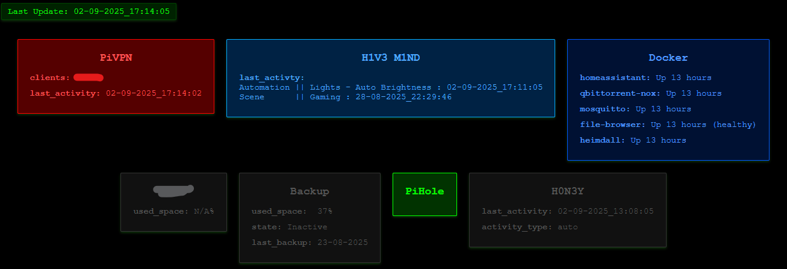

# Service Stats - Monitoring the status of services

## Overview

Simple web UI that displays installed service status in real-time.



## Features

- **Service Monitoring**: Various parameters and status of a service can be easily monitored. Running services and mounted devices are lit up, and inactive ones are greyed out.
- **Storage Device Monitoring**: Storage devices display mount status and used space.
- **Customizable**: Styling can be adjusted based on preferences.

## Technologies Used

- **JSON**: For a readable and writeable structure by various scripting languages.
- **HTML**: For an easy hosting and access from any platform.

## Usage

The page renders a JSON that contains values for status of installed services real-time. New services can be added by adding commands to change the json.

## JSON Structure

Each service's value is changed from the service script itself. Easily accessible and writeable.

```json
"PiVPN": {
   "running": true,
   "clients": "Client1",
   "last_activity": "02-09-2025_17:32:02"
},
"Service1": {
    "running": false,
    "last_run": "23-08-2025",
    "last_activty": "auto_backup"
},
"Docker": {
    "container1": "Up 13 hours",
    "container2": "Up 8 hours",
    "container3": "Up 19 hours (healthy)",
  },
"Storage1": {
    "mount": "not mounted",
    "used_space": "38%"
}
```

## HTML Rendering

The HTML page is responsible for rendering the JSON values in an understandable UI. Each Service has it's own container to display its stats.

```html
<!DOCTYPE html>
<html lang="en">

<head>
	<meta charset="UTF-8">
	<meta name="viewport" content="width=device-width, initial-scale=1.0">
	<title>Service Stats</title>
	<link rel="stylesheet" href="./styles.css">
	<style>
		body {
			background-image: url('/IMG/PATH/');
			background-size: cover;
			background-attachment: fixed;
			background-position: center;
		}
	</style>
</head>

<body>
	<div id="last-update"></div>
	<div id="service-stats-container"></div>

	<script>
		// Fetch the JSON data dynamically
		fetch('/dev/scripts/ServiceStats.json')
			.then(response => response.json())
			.then(data => {
				// Populate the service stats
				const container = document.getElementById('service-stats-container');
				for (const [serviceName, stats] of Object.entries(data)) {
					// Determine if the box should be greyed out based on the "running" and "mount" keys
					const isRunning = stats.running !== false;
					const isMounted = stats.mount !== "not mounted";

					// Create the service box
					const serviceBox = document.createElement('div');
					serviceBox.className = `service-box ${isRunning && isMounted ? '' : 'greyed-out'}`;

					// Add service-specific classes
					if (serviceName.toLowerCase() === 'pivpn') {
						serviceBox.classList.add('pivpn');
					} else if (serviceName.toLowerCase() === 'h1v3 m1nd') {
						serviceBox.classList.add('h1v3-m1nd');
					} else if (serviceName.toLowerCase() === 'docker') {
						serviceBox.classList.add('docker');
					}

					// Create the service box content dynamically
					let content = `<h3>${serviceName}</h3>`;
					for (const [key, value] of Object.entries(stats)) {
						if (key !== 'running' && key !== 'mount') { // Exclude the "running" and "mount" keys
							if (Array.isArray(value)) {
								// If the value is an array, join items with line breaks
								content += `<p><strong>${key}:</strong><br>${value.join('<br>')}</p>`;
							} else {
								content += `<p><strong>${key}:</strong> ${value}</p>`;
							}
						}
					}

					serviceBox.innerHTML = content;
					container.appendChild(serviceBox);
				}
			})
			.catch(error => console.error('Error fetching service stats:', error));
	</script>
</body>

</html>
```
